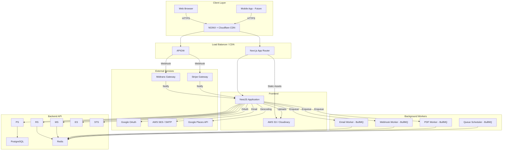

# Multi-Vendor E-Commerce Platform

Enterprise-grade multi-vendor e-commerce platform built with **NestJS**, **Next.js**, **PostgreSQL**, and **Redis**..

## Architecture



## System Components

| Layer | Technology |
|-------|------------|
| Frontend | Next.js 14 (App Router), TypeScript, TailwindCSS |
| Backend | NestJS, TypeScript |
| Database | PostgreSQL (Primary), Redis (Cache, Session, Queue) |
| ORM | Prisma |
| Message Queue | BullMQ (Redis-based) |
| Storage | AWS S3 / Cloudflare R2 / Cloudinary |
| Payments | Midtrans, Stripe |
| Auth | JWT + HTTP-Only Cookies, Google OAuth2 |
| Email | SMTP / AWS SES |
| Geocoding | Google Places API |
| Testing | Jest (Unit/Integration), Playwright (E2E) |

## Data Flow

1. **Customer Browsing** → Frontend fetches from Backend API → Redis cache check → PostgreSQL query → Redis cache set
2. **Product Search** → Frontend (debounced) → Backend API → Full-text search (PostgreSQL) → Results cached
3. **Add to Cart** → Redis (temporary) + PostgreSQL (persistent)
4. **Checkout** → Order created in DB transaction → Payment gateway integration → Webhook processing → Split vendor wallets
5. **Vendor Order** → Stock deduction triggers on payment → Webhook processes payout to vendor wallet

## Project Structure

```
multi-vendor-ecommerce/
├── backend/              # NestJS API
│   ├── src/
│   │   ├── auth/         # JWT, OAuth2, Email verification
│   │   ├── users/        # Profile, Address book
│   │   ├── vendors/      # Vendor onboarding, approval
│   │   ├── products/     # Product, Variant, Image management
│   │   ├── categories/   # Hierarchical taxonomy
│   │   ├── cart/         # Multi-vendor cart
│   │   ├── orders/       # Order processing, fulfillment
│   │   ├── payments/     # Midtrans/Stripe, webhooks
│   │   ├── reviews/      # Verified purchase reviews
│   │   ├── admin/        # Dashboard, RBAC, payouts
│   │   ├── banners/      # Promotional banners
│   │   ├── settings/     # Global configuration
│   │   ├── common/       # Shared utilities, guards, interceptors
│   │   ├── prisma/       # Prisma service
│   │   ├── redis/        # Redis service
│   │   ├── email/        # Email service
│   │   └── storage/      # File upload service
│   ├── test/             # Jest test suites
│   ├── Dockerfile
│   ├── package.json
│   └── tsconfig.json
├── frontend/             # Next.js App
│   ├── app/
│   │   ├── (auth)/       # Login, Register, Forgot Password
│   │   ├── (shop)/       # Shop pages
│   │   ├── vendor/       # Vendor dashboard
│   │   ├── admin/        # Admin dashboard
│   │   ├── cart/         # Shopping cart
│   │   ├── checkout/     # Payment checkout
│   │   ├── products/     # Product listing
│   │   ├── product/      # Product detail
│   │   ├── categories/   # Category listing
│   │   └── profile/      # User profile
│   ├── components/       # UI components (Shadcn-style)
│   │   ├── ui/           # Base components
│   │   ├── layout/       # Header, Footer, Sidebar
│   │   ├── product/      # Product-specific components
│   │   └── cart/         # Cart-specific components
│   ├── lib/              # API client, utilities
│   ├── hooks/            # Custom hooks
│   ├── types/            # TypeScript types
│   ├── Dockerfile
│   ├── package.json
│   └── tsconfig.json
├── prisma/               # Database
│   ├── schema.prisma     # Database schema (24 models)
│   └── seed.ts           # Seeder with 2000+ products
├── docker/               # Docker configs
│   ├── backend.Dockerfile
│   └── frontend.Dockerfile
├── docker-compose.yml
├── .gitignore
├── README.md
└── AGENTS.md
```

## Quick Start

### Prerequisites

- Node.js >= 20
- Docker & Docker Compose
- npm

### Setup

```bash
# Clone the repository
git clone <repository-url>
cd multi-vendor-ecommerce-platform

# Start databases with Docker
docker-compose up -d postgres redis

# Backend setup
cd backend
cp .env.example .env
npm install
npx prisma generate --schema ../prisma/schema.prisma
npm run dev

# Frontend setup (in separate terminal)
cd ../frontend
cp .env.local.example .env.local
npm install
npm run dev
```

### Environment Variables

**Backend (.env):**
- `DATABASE_URL` - PostgreSQL connection string
- `REDIS_URL` - Redis connection string
- `JWT_SECRET` - JWT signing secret
- `MIDTRANS_SERVER_KEY` / `MIDTRANS_CLIENT_KEY` - Midtrans API keys
- `STRIPE_SECRET_KEY` - Stripe secret key
- `SMTP_HOST`, `SMTP_USER`, `SMTP_PASS` - SMTP configuration
- `AWS_ACCESS_KEY_ID`, `AWS_SECRET_ACCESS_KEY` - AWS credentials
- `GOOGLE_CLIENT_ID`, `GOOGLE_CLIENT_SECRET` - OAuth2 credentials

### API Documentation

Once the backend is running, Swagger UI is available at:

```
http://localhost:4000/api/docs
```

### Database Seeding

```bash
# Run the seeder (requires PostgreSQL running)
cd backend
npm run prisma:seed
```

This creates:
- 500+ users (50 vendors, 500+ buyers)
- 60+ categories (8 top-level, 50+ sub-categories)
- 2,000+ products with variants and images
- 1,000+ orders with payments and wallet transactions
- 500+ reviews
- 5 promotional banners

## Testing

```bash
# Backend
cd backend
npm test                    # Unit tests
npm run test:e2e           # E2E tests

# Frontend
cd frontend
npm test                   # Unit tests
npm run test:e2e           # E2E tests (Playwright)

# Linting
npm run lint --fix
```

## Security Features

- JWT with HTTP-Only Secure Cookies
- AES-256 data encryption at rest
- SQL injection prevention via Prisma ORM
- XSS prevention via input sanitization
- CSRF protection
- CORS policy
- Rate limiting (Redis-based)
- Idempotency keys on payment endpoints
- Role-based access control (RBAC)

## License

MIT
